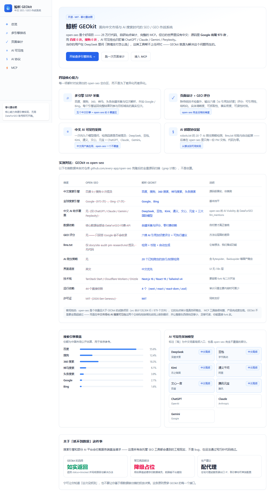
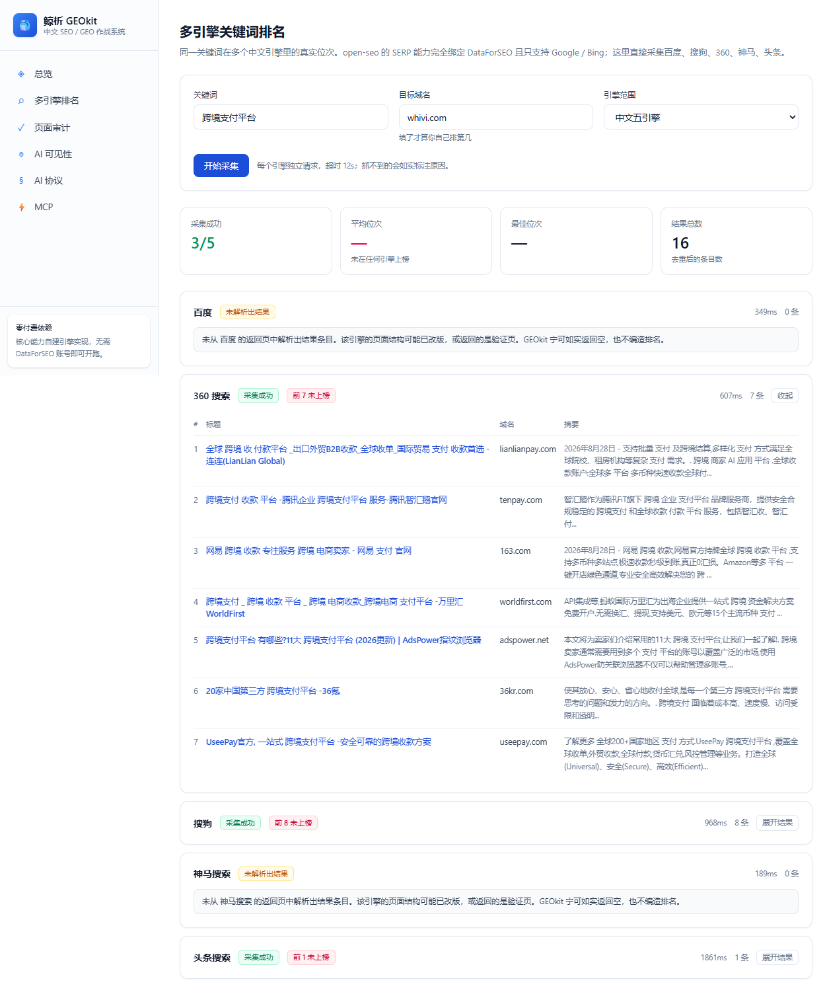
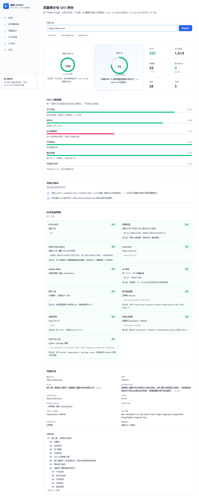
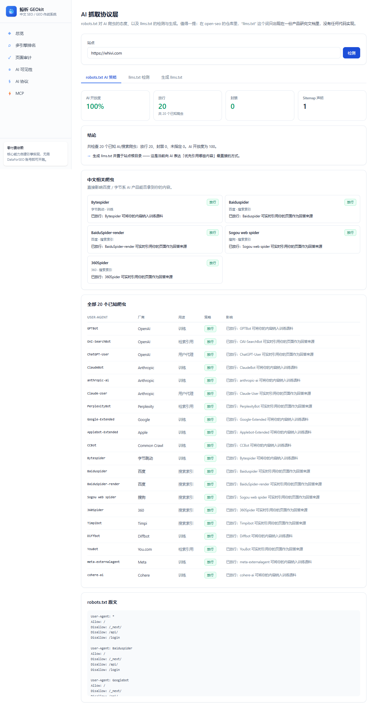
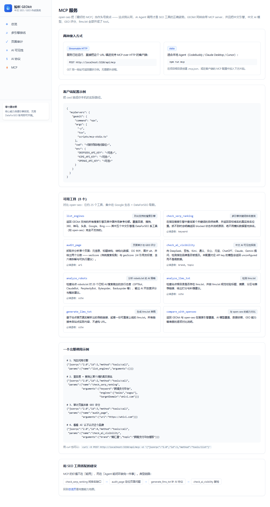

# 鲸析 GEOkit

> 面向中文市场与 AI 搜索时代的开源 SEO / GEO 作战系统


[](https://github.com/WilstonZhou/geokit/actions/workflows/ci.yml)


**中文优先的 SEO / GEO 工具**：自建百度 / 搜狗 / 360 / 神马 / 头条采集，
六维 GEO 评分，九个 AI 模型的品牌可见性探测，以及一套 AI 抓取协议层。
全部能力通过 MCP 开放给 Agent。

**[为什么造它 →](docs/ANALYSIS.md)** · [贡献指南 →](CONTRIBUTING.md)

GEOkit 源于对 [every-app/open-seo](https://github.com/every-app/open-seo) 的一次深度拆解。
open-seo 是个好项目 —— 28 万行代码、自研站点审计爬虫、完整的 MCP 工具链、相当高的产品完成度。
但它有一个结构性盲区：**它的世界里没有中文**。

这不是营销话术，是对其仓库全量源码实测后的事实：

| 事实项 | 观测结果（源码级） |
| --- | --- |
| `google` 在 open-seo 源码中出现 | **973 次** |
| `bing` 出现 | 7 次 |
| `baidu` 出现 | **0 次** |
| `sogou` 出现 | **0 次** |
| AI Visibility 覆盖模型 | ChatGPT / Claude / Gemini / Perplexity（**六个中文 AI 助手全部缺席**） |
| `llms.txt` 实现 | 仅出现在 `docs/site-audit-pm-research.md` 一份 PM 文档中，**代码为零** |

当你的客户在 DeepSeek 里问「跨境支付怎么选」，这类工具帮不上任何忙 —— GEOkit 就是为解决这个问题而生的。

---

## 它做什么

| 能力 | 说明 |
| --- | --- |
| **多引擎 SERP 采集** | 百度、搜狗、360、神马、头条的自建采集与位次解析，外加 Google / Bing |
| **页面审计 + GEO 评分** | 除传统技术检查外，输出六维「AI 引用友好度」评分 |
| **中文 AI 可见性矩阵** | 九个模型并发探测品牌是否被提及 |
| **AI 抓取协议层** | robots.txt 的 20 个 AI 爬虫策略检测、llms.txt 校验与自动生成 |
| **MCP Server** | 上述全部能力对外开放，两种传输方式 |

## 界面

首页把能力地图、与 open-seo 的逐项对比、以及"抓不到就说抓不到"的处理原则摊在一屏里：



<table>
<tr>
<td width="50%"><b>多引擎关键词排名</b><br>中文引擎真实位次，摘要为可直接阅读的正文（下图为「跨境支付平台」实采）</td>
<td width="50%"><b>页面审计与 GEO 评分</b><br>六维 AI 引用友好度拆解 + 37 项技术检查明细</td>
</tr>
<tr>
<td></td>
<td></td>
</tr>
<tr>
<td><b>AI 抓取协议层</b><br>20 个 AI 爬虫的 robots 策略 + llms.txt 校验与生成</td>
<td><b>MCP Server</b><br>8 个工具、两种传输方式，附可直接粘贴的接入配置</td>
</tr>
<tr>
<td></td>
<td></td>
</tr>
</table>

## 快速开始

```bash
npm install
npm run dev        # http://localhost:3210
```

核心功能不需要任何付费 API —— 装上就能跑。

## GEO 评分是什么

传统 SEO 检查只回答「Google 会不会收录我」。2026 年真正的问题是「AI 愿不愿意引用我」。
GEOkit 的 `geoScore` 由六个可观测维度构成：

| 维度 | 权重 | 看什么 |
| --- | --- | --- |
| 可引用性 | 25 | 是否有结论前置、列表、表格、可摘取的数据点 |
| 结构化 | 20 | JSON-LD 类型数、H 标签层级、canonical |
| 实体清晰度 | 15 | 作者、组织、发布时间是否被标注 |
| 可抓取性 | 15 | robots 策略、语言声明、内容可获取性 |
| 事实密度 | 15 | 每千字数据点数、外部权威引用数量 |
| 可读性 / 时效 | 10 | 平均句长、是否有 modified_time |

每一项都由页面里真实存在的信号计算，输出时会附上「为什么得这个分」的依据，而不是一个孤立的数字。

## MCP 接入

**Streamable HTTP**（服务已在跑）：

```
POST http://localhost:3210/api/mcp
```

**stdio**（本地 Agent）：

```json
{
  "mcpServers": {
    "geokit": {
      "command": "npx",
      "args": ["-y", "tsx", "scripts/mcp-stdio.ts"],
      "cwd": "<你的项目绝对路径>",
      "env": {}
    }
  }
}
```

八个工具：`list_engines`、`check_serp_ranking`、`audit_page`、`check_ai_visibility`、
`analyze_robots`、`analyze_llms_txt`、`generate_llms_txt`、`compare_with_openseo`。

典型 Agent 闭环：找排名缺口 → 定位页面问题 → 补 AI 协议 → 复检 AI 可见性。

## 可选的环境变量

只有「AI 可见性」这个功能需要 API key，其余全部零依赖。写在 `.env.local`：

```bash
DEEPSEEK_API_KEY=    # DeepSeek
DOUBAO_API_KEY=      # 豆包
KIMI_API_KEY=        # Kimi
QWEN_API_KEY=        # 通义千问
WENXIN_API_KEY=      # 文心一言
YUANBAO_API_KEY=     # 腾讯元宝
OPENAI_API_KEY=      # ChatGPT
ANTHROPIC_API_KEY=   # Claude
GEMINI_API_KEY=      # Gemini
```

## 一条原则：抓不到就说抓不到

搜索引擎和部分 AI 平台会拦截服务端直连请求。这是所有自托管 SEO 工具都会遇到的工程现实，
不是 bug，也没法靠写巧妙的代码绕过。

GEOkit 的选择是**如实返回 `status: "blocked"` 并写明原因与解决方向**，绝不用估算值、
缓存旧数据或随机数冒充真实排名。宁可让你知道「这次没抓到」，也不要让你基于假数据
做出错的投放决策。这条原则贯穿每一个接口。

## 技术栈

Next.js 16 / React 19 / Tailwind v4 / TypeScript。**直接依赖只有 4 个**
（next、react、react-dom、zod）—— HTML 解析、排序计算、robots 解析全部自研，
目的是让整套东西保持足够小、足够可读，你能直接 fork 开改。

对比 open-seo 的 44 个直接依赖 + TanStack Start + Cloudflare Workers + Drizzle，
GEOkit 牺牲了一部分功能广度，换取的是**可理解性与可改造性**。

## 项目结构

```
src/
  lib/
    engines.ts      搜索引擎注册表（7 个引擎，5 个是 open-seo 的空白区）
    html.ts         零依赖 HTML 解析
    serp.ts         多引擎采集与位次解析
    audit.ts        页面审计 + GEO 六维评分
    visibility.ts   中文 AI 可见性探测矩阵
    llms.ts         robots AI 策略 + llms.txt 检测与生成
    mcp.ts          MCP server（JSON-RPC 2.0）
  app/
    api/{audit,serp,visibility,llms,mcp}/route.ts
    {serp,audit,visibility,llms,mcp}/page.tsx
scripts/mcp-stdio.ts   stdio 传输入口
```

## 许可证

MIT
