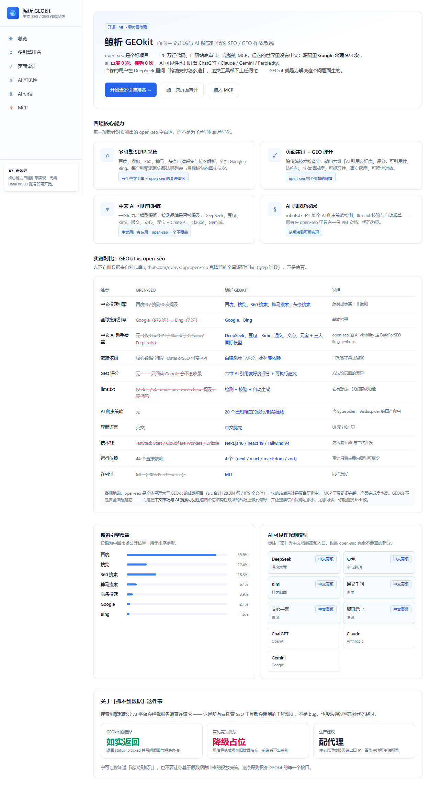
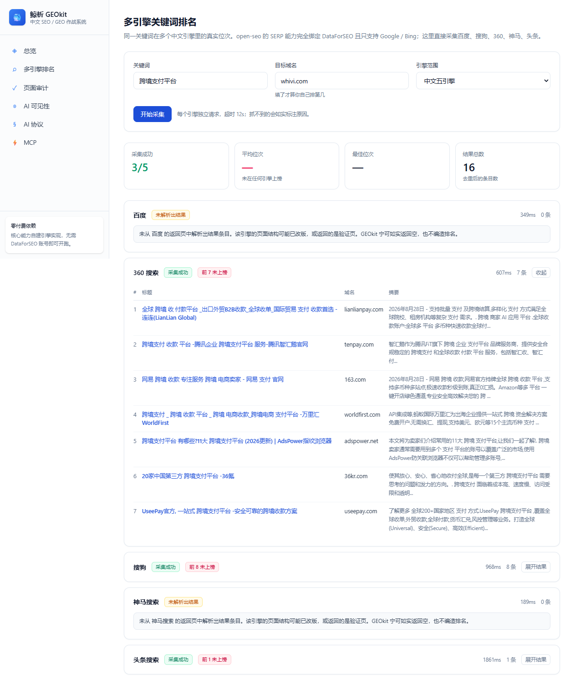
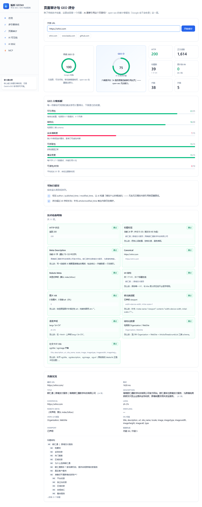
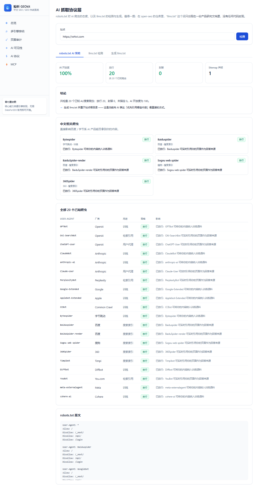
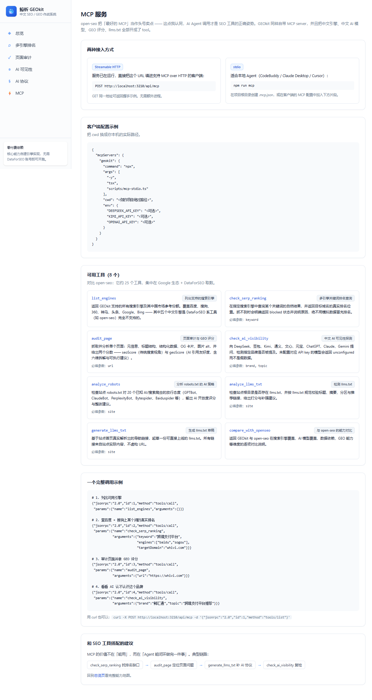

---
AIGC:
  ContentProducer: '001191110102MAD55U9H0F10002'
  ContentPropagator: '001191110102MAD55U9H0F10002'
  Label: '1'
  ProduceID: '6b9414ca-b1fb-4c4b-a1a0-07811ce02a3f'
  PropagateID: '6b9414ca-b1fb-4c4b-a1a0-07811ce02a3f'
  ReservedCode1: '924bebf3-6f3b-42e2-99b1-c9a3e8febb36'
  ReservedCode2: '924bebf3-6f3b-42e2-99b1-c9a3e8febb36'
---

# 鲸析 GEOkit

> 面向中文市场与 AI 搜索时代的开源 SEO / GEO 作战系统

[](https://github.com/WilstonZhou/geokit/actions/workflows/ci.yml)
[](https://github.com/WilstonZhou/geokit/releases)


**中文优先的 SEO / GEO 工具**：自建百度 / 搜狗 / 360 / 神马 / 头条采集，
六维 GEO 评分，九个 AI 模型的品牌可见性探测，以及一套 AI 抓取协议层。
全部能力通过 MCP 开放给 Agent。

> 范围注：CLI / SARIF 门禁、`diagnose_page` 与 `apply_fixes` 超出 T0–T13 主线任务书，作为附带能力存在，不影响主线契约。

**[为什么造它 →](docs/ANALYSIS.md)** · [贡献指南 →](CONTRIBUTING.md)

GEOkit 源于对 [every-app/open-seo](https://github.com/every-app/open-seo) 的一次深度拆解。
open-seo 是个好项目 —— 28 万行代码、自研站点审计爬虫、完整的 MCP 工具链、相当高的产品完成度。
但它有一个结构性盲区：**它的世界里没有中文**。

这不是营销话术，是对其仓库全量源码实测后的事实：

| 事实项 | 观测结果（源码级） |
| --- | --- |
| `google` 在 open-seo 源码中出现 | **973 次** |
| `bing` 出现 | 7 次 |
| `baidu` 出现 | **0 次** |
| `sogou` 出现 | **0 次** |
| AI Visibility 覆盖模型 | ChatGPT / Claude / Gemini / Perplexity（**六个中文 AI 助手全部缺席**） |
| `llms.txt` 实现 | 仅出现在 `docs/site-audit-pm-research.md` 一份 PM 文档中，**代码为零** |

当你的客户在 DeepSeek 里问「跨境支付怎么选」，这类工具帮不上任何忙 —— GEOkit 就是为解决这个问题而生的。

---

## 它做什么

| 能力 | 说明 |
| --- | --- |
| **多引擎 SERP 采集** | 百度、搜狗、360、神马、头条的自建采集与位次解析，外加 Google / Bing |
| **页面审计 + GEO 评分** | 除传统技术检查外，输出六维「AI 引用友好度」评分 |
| **中文 AI 可见性矩阵** | 九个模型并发探测品牌是否被提及，并升级为引用情报（谁被引用、引用了哪些来源、我的缺口在哪） |
| **AI 抓取协议层** | robots.txt 的 20 个 AI 爬虫策略检测、llms.txt 校验与自动生成 |
| **观测与存档** | 全通道 Observation 落库 + 不可变 Evidence 存证，时序 diff 识别提升与退化 |
| **MCP Server** | 上述全部能力对外开放，两种传输方式 |

## 界面

首页把能力地图、与 open-seo 的逐项对比、以及"抓不到就说抓不到"的处理原则摊在一屏里：



<table>
<tr>
<td width="50%"><b>多引擎关键词排名</b><br>中文引擎真实位次，摘要为可直接阅读的正文（下图为「跨境支付平台」实采）</td>
<td width="50%"><b>页面审计与 GEO 评分</b><br>六维 AI 引用友好度拆解 + 11 项技术检查明细</td>
</tr>
<tr>
<td></td>
<td></td>
</tr>
<tr>
<td><b>AI 抓取协议层</b><br>20 个 AI 爬虫的 robots 策略 + llms.txt 校验与生成</td>
<td><b>MCP Server</b><br>23 个核心工具、两种传输方式，附可直接粘贴的接入配置</td>
</tr>
<tr>
<td></td>
<td></td>
</tr>
</table>

## 快速开始

```bash
npm install
npm run dev        # http://localhost:3210
```

核心功能不需要任何付费 API —— 装上就能跑。

## 数据源原则（强制）

**项目所有数据源必须是自建检索（自写爬虫/解析器直接拿数据）或免费开源工具获取，不引入任何付费数据源。**

| 数据源 | 获取方式 |
| --- | --- |
| SERP（百度/搜狗/360/神马/头条/Google/Bing） | 自建采集 + 位次解析（`src/lib/serp.ts` + `engines.ts`） |
| 页面审计 / GEO 评分信号 | 自建抓取 + 本地分析（`src/lib/audit.ts`） |
| robots.txt / llms.txt | 自建协议层（`src/lib/llms.ts`） |
| 存储 | JSONL + `node:sqlite`（Node 内置，零新增依赖） |
| CI / 门禁 | GitHub Actions 免费层 + 本地 CLI |

唯一豁免：**AI 可见性探测**（`src/lib/visibility.ts`）调用 9 家模型厂商官方接口，
需要用户自行填入 API key 才能使用 —— 这是项目里唯一的付费通道，且未配 key 时如实返回
`UNOBSERVABLE`，绝不伪造结果。

## GEO 评分是什么

传统 SEO 检查只回答「Google 会不会收录我」。2026 年真正的问题是「AI 愿不愿意引用我」。
GEOkit 提供两套严格版本化的 `geoScore` 评分模型（可在 Web UI、CLI `--geo-version` 与 MCP 参数中灵活切换）：

### GEO 2.0.0（2026 AI Search & RAG Grounding 启发式 · 推荐）

面向 Google SGE/AI Overviews、ChatGPT Search、Perplexity 与企业 RAG 知识检索：

| 维度 | 权重 | 2026 评估信号 |
| --- | --- | --- |
| 可引用性 Quotability | 25 | 首屏直接回答（Direct Answer 100-200 字）、对比表格、步骤列表、硬核量化数据点、**FAQ/Q&A 结构** |
| 结构化/RAG 切块 Structuredness | 20 | 标题层级连续性（**严格递进，H1->H3/H4 跳级惩罚**以保护 RAG 分块树）、`<main>`/`<article>` 语义地标、**结构化元素密度** |
| 实体清晰度/消歧 Entity Clarity | 15 | 大模型知识图谱消歧（JSON-LD `sameAs`/`identifier`）、明确作者与双时间戳锚点、**作者权威链接** |
| 可抓取性/AI 协议 Crawlability | 15 | AI 爬虫通道放行、显式 `lang` 语言声明（指导多语言 Embedding 向量分词路由） |
| 事实密度/增益 Fact Density | 15 | 信息增益（Information Gain）、每千字量化数据指标、一手权威参考引用、**gov/edu 权威来源** |
| 分块适配/时效 Readability & Freshness | 10 | 大模型滑动窗口与注意力集中最优句长（15-45 字符区间）、最新修订时间戳、**更新时间一致性** |

> **scoringVersion 2.1.0（T9 内容质量增强）**：在六维 max 与总分 100 不变前提下，
> 并入 5 个新页面级可观测信号（上表加粗项）。各维内部子权重重分配，不新增并行总分。
> 每条观测记录携带 `scoringVersion` 字段，diff 引擎识别版本不同时保持可比并附加 caveat，
> 避免历史比对被规则换代污染。第 4 维（可抓取性）页面级信号已饱和，不新增。

### GEO 1.0.0（经典基线模式）

完全保持与项目既有 baseline 一致的特征统计打分体系，供历史比对与 CI 回归基线。

每一项都由页面里真实存在的信号计算，输出时会附上「为什么得这个分」的依据，而不是一个孤立的数字。

## MCP 接入

**Streamable HTTP**（服务已在跑）：

```
POST http://localhost:3210/api/mcp
```

**stdio**（本地 Agent）：

```json
{
  "mcpServers": {
    "geokit": {
      "command": "npx",
      "args": ["-y", "tsx", "scripts/mcp-stdio.ts"],
      "cwd": "<你的项目绝对路径>",
      "env": {}
    }
  }
}
```

25 个工具：
- 采集与审计：`list_engines`、`check_serp_ranking`、`audit_page`、`check_ai_visibility`、`crawl_site`
- 诊断与修复：`diagnose_page`（全量诊断与体检）、`apply_fixes`（安全幂等自动修复）
- 时序与数据：`list_observations`（历史观测查询，兼容别名 `query_history`）、`diff_observations`（时序对比与退化判定）
- 引用情报：`analyze_ai_citations`（引用来源排行 / 竞品频次 / 引用缺口，附 evidence）
- 协议与对比：`analyze_robots`、`analyze_llms_txt`、`generate_llms_txt`、`compare_with_openseo`
- 搜索表现：`get_search_performance`、`analyze_search_opportunities`（GSC，可选凭证）
- 性能观测：`check_web_vitals`（CrUX 真实用户数据，LCP/INP/CLS/FCP/TTFB）
- 机会引擎：`list_opportunities`、`verify_opportunity`
- Query 情报：`analyze_query`、`cluster_queries`
- 竞品：`compare_competitors`（五维对比）
- Schema：`analyze_schema`（页面类型/字段/一致性/实体诊断）、`generate_schema_draft`（零编造 JSON-LD 草稿）
- 国际化：`check_hreflang`（三种来源 hreflang 检查：自引用/回链/非法代码/坏链/canonical 冲突/x-default/语言声明疑似不一致）

典型 Agent 闭环：找排名缺口 → 页面深度诊断 → 自动应用修复 → 复查 AI 协议 → 历史比对确认退化/提升。

## 可选的环境变量

只有「AI 可见性」需要 API key，「CrUX 性能观测」可选 API key（无 key 时 unavailable）。写在 `.env.local`：

```bash
DEEPSEEK_API_KEY=    # DeepSeek
DOUBAO_API_KEY=      # 豆包
KIMI_API_KEY=        # Kimi
QWEN_API_KEY=        # 通义千问
WENXIN_API_KEY=      # 文心一言
YUANBAO_API_KEY=     # 腾讯元宝
OPENAI_API_KEY=      # ChatGPT
ANTHROPIC_API_KEY=   # Claude
GEMINI_API_KEY=      # Gemini
CRUX_API_KEY=        # Chrome UX Report API（可选，T11 性能观测用）
```

## 一条原则：抓不到就说抓不到

搜索引擎和部分 AI 平台会拦截服务端直连请求。这是所有自托管 SEO 工具都会遇到的工程现实，
不是 bug，也没法靠写巧妙的代码绕过。

GEOkit 的选择是**如实返回 `status: "blocked"` 并写明原因与解决方向**，绝不用估算值、
缓存旧数据或随机数冒充真实排名。宁可让你知道「这次没抓到」，也不要让你基于假数据
做出错的投放决策。这条原则贯穿每一个接口。

## 观测与存档（Observation Store）

GEOkit 遵循两层分离的数据契约：**Evidence（存证）**是原始请求 / 响应的不可变记录
（append-only，永不改写）；**Observation（观测）**是基于 Evidence 的结构化结论，
带 observer / parser 版本与状态，可随时重算追溯。

默认**不写盘**。设置 `GEOKIT_EVIDENCE=on` 打开总闸后，以下通道会把结论落成 Observation：

| kind | 来源通道 |
| --- | --- |
| `geo_score` | 页面审计 + GEO 评分 |
| `rank` | 多引擎 SERP 排名 |
| `ai_mention` / `ai_citation` | AI 可见性探测 / 引用情报 |
| `robots_policy` / `llms_txt` | AI 抓取协议层（robots.txt / llms.txt） |

存储实现（零新增依赖，接口抽象、可换驱动）：

- 默认 JSONL，写入 `.evidence/`（已加入 `.gitignore`，不会进 git）；
- `GEOKIT_STORE_DRIVER=sqlite` 切换为 Node 内置 `node:sqlite`；
- `GEOKIT_STORE_DIR` 自定义存档目录；`GEOKIT_EVIDENCE_BODY=on` 额外留存响应体（默认 hash-only）。

**schema 层强制约束**：`status` 为 `blocked` / `unavailable` / `error` 时 `statusReason`
必填 —— 「抓不到就要说清为什么」在数据模型层强制执行，缺 reason 的观测写入即被拒绝。

MCP 查询入口：`list_observations` 按 kind / subject / 时间过滤历史；
`diff_observations` 对比两次观测的结构化差异（新增 / 消失 / 变化 + 证据），识别真实提升与退化。

## AI 可见性与引用情报

九个模型（DeepSeek / 豆包 / Kimi / 通义千问 / 文心一言 / 腾讯元宝 / ChatGPT / Claude / Gemini）
并发探测品牌可见性。未配 key 的模型如实返回 `UNOBSERVABLE`，绝不伪造。

### 引用数据可得性（以代码实际行为为准）

对每个 (query, model)，GEOkit 从模型回答文本中提取**真实存在**的链接
（Markdown 链接与裸 URL，含全角标点容错），产出 CitationRecord：

- 答案中含链接 → `citationsStatus: "ok"`，附 url / title / 出现位置；
- 答案不含链接 → `citationsStatus: "unavailable"` 并注明原因（「模型响应中未包含可提取的引用链接」）；
- 模型拒答（HTTP 4xx）→ `blocked`；我方调用失败 → `error`。

**严禁编造**：不向模型索要「记忆中的来源」，不用其他模型代答，无响应时不返回示例数据。
是否在答案里给链接取决于各厂商行为（如 Kimi 联网搜索常带来源），GEOkit 只如实记录「给没给」，不试图补齐。

### 批量、对比与聚合

- 多 query 批量探测（并发上限可配置，默认保守值 2；探测函数可注入便于测试），单个模型失败不影响其他模型；
- 竞品监控：`check_ai_visibility` 与 `analyze_ai_citations` 均接受可选 `competitors` 列表，
  答案中提及的竞品会标注在每条引用记录上（`competitorsMentioned`）；单次调用超时可用
  `GEOKIT_AI_TIMEOUT_MS` 环境变量覆盖（默认 30s）；
- `/visibility` 页面提供 query × model 矩阵，`unavailable` / `blocked` 状态明确展示原因，不留空白；
- 与上一次观测自动 diff：哪些模型新增 / 失去了提及或引用；
- MCP 工具 `analyze_ai_citations` 输出引用来源排行、竞品出现频次、引用缺口
  （被多个模型引用、但你的域名没出现的来源域名），每条结论附 evidence。

## 站点爬虫（Site Crawler）

GEOkit 从单页审计升级为站点级审计的基础。一个有礼貌、有上限、可中断的爬虫，
产出站点图与每页 GEO 评分，作为 `Observation(kind="crawl")` 存档，支持两次爬取的 diff。

### 礼貌爬取声明

- **遵守 robots.txt**：Disallowed 路径不爬；识别并遵守 Crawl-delay；
- **保守默认**：并发 ≤ 2、同 host 最小间隔 500ms、最大页面 100、最大深度 3、总耗时 2 分钟；
- **不绕过反爬**：403/验证码按 `blocked` 状态如实记录原因，不尝试绕过；
- **无头浏览器**：不使用 Puppeteer/Playwright，不执行 JS 渲染内容；
- **可中断**：达到任一上限时返回已爬结果并标明 `truncated: true` + 原因。

### 爬取策略

1. 起点：给定域名/URL；优先读取 robots.txt 与 sitemap（含 sitemap index 递归解析），
   再从页面 `<a href>` 链接补充发现；
2. 仅限同域（可配置 `includeSubdomains` 包含子域）；
3. URL 规范化与去重：去 fragment、参数排序、尾斜杠策略、忽略静态资源（`.css/.js/.png` 等）；
4. 跳转链、4xx/5xx、超时都作为数据记录下来，不丢弃；
5. 每个页面产出：URL、状态码、跳转链、title、meta description、H1、canonical、noindex、
   hreflang、JSON-LD 类型、内链/外链数、字数、GEO 六维评分（复用 `audit.ts` 的 `analyze` 纯函数）；
6. 站点图：URL 节点 + 内链边 + 入链数 + 点击深度 + 孤岛页标记（sitemap 有但无内链指向）。

### 使用方式

```bash
# API
curl -X POST http://localhost:3000/api/crawl \
  -H "Content-Type: application/json" \
  -d '{"site":"example.com","config":{"maxPages":50,"maxDepth":2}}'

# MCP 工具
crawl_site(site: "example.com", maxPages?: 100, maxDepth?: 3, concurrency?: 2)

# Web 界面：访问 /crawl
```

两次爬取的 diff（新增/消失/状态变化的页面）通过 `diffCrawlResults` 纯函数计算，
匹配键为 URL，输出 `CrawlDiff { added[], removed[], statusChanged[], unchangedCount }`。

### 站点级问题聚合（T4）

爬取结束后自动对结果跑 8 类规则检查（`analyzeSiteIssues` 纯函数，不调模型），
每个问题都带稳定 `id`、`severity`（high/medium/low）、受影响 URL、`evidence[]`、
一句话影响说明与修复建议：

1. 重复 title / meta description / H1（给出具体 URL 分组）；
2. 缺失 title / description / H1 / canonical；
3. canonical 指向异常（其他域名 / 4xx / 会跳转的 URL）；
4. 孤岛页、点击深度过深、内链过少；
5. 跳转链过长、跳转循环、内链坏链（指向 4xx/5xx）；
6. 结构化数据覆盖率（各 JSON-LD 类型占比 + 长文页缺 Schema）；
7. GEO 汇总：分数段分布、最低分页面、拖累整站的共性弱维度（同一维度 ≥3 页偏弱）；
8. 疑似内容重复：正文 5-gram shingle Jaccard ≥ 0.8，结论永远标注「疑似」并给出相似度依据。

severity 阈值是可读常量（`src/lib/crawler/issues.ts` 顶部导出，如
`DEEP_PAGE_DEPTH`、`LOW_GEO_SCORE_HIGH/MEDIUM`、`DUPLICATE_CONTENT_JACCARD`），
均有命中/不命中两个方向的单测。问题只对「可索引的 2xx 页面」成立 ——
4xx/5xx、blocked、noindex 页面不会被误报内容缺失。

- `crawl_site` MCP 输出新增 `issues` / `geoSummary` / `schemaCoverage`（仅新增字段，向后兼容）；
- `/crawl` 页面可按严重度与类型筛选问题，点击展开查看受影响 URL 与证据。

### Google Search Console 搜索表现（T5，可选）

接入真实 Search Console Search Analytics，按 `query` / `page` / `country` / `device` / `date`
维度拉取 clicks、impressions、ctr、position，自动分页（单页 1000、硬上限 25000 行）。

**凭证（自备，零新增依赖，三选一，写进 `.env.local`）：**

1. `GOOGLE_OAUTH_ACCESS_TOKEN` —— OAuth access token（约 1 小时有效）；
2. `GOOGLE_SERVICE_ACCOUNT_JSON` —— service account JSON 内联，GEOkit 用 `node:crypto`
   手工构造 RS256 JWT 向 Google 换取 access token 并按过期时间缓存；
3. `GOOGLE_APPLICATION_CREDENTIALS` —— service account JSON 文件路径。

service account 必须在对应 Search Console 资源里被添加为用户（资源可以是
`sc-domain:example.com` 或 `https://example.com/`）。**凭证不写日志、不进存档。**

未配置任何凭证时能力返回 `status=unavailable` 并说明配置方式；401/403/429 分别返回
`blocked` 并写明原因（令牌无效 / 无资源权限 / 配额限流），5xx 与网络异常为 `error` —— 不编造任何数据。

机会分析（`src/lib/gsc/analyze.ts`，纯函数，阈值为导出常量）识别三类机会：

- **高曝光低 CTR**：展示量 ≥ 100 且 CTR < 2%；
- **排名机会位**：平均位置 4–20 且展示量 ≥ 50；
- **内容缺口**：GSC 显示某 URL 有曝光，但不在站点爬取集合中（需传 crawledUrls 交叉）。

另有 `diffPeriods(prev, cur)` 对比两期，输出排名/点击显著升降与新增、消失的 key
（低曝光样本自动降噪）。GSC 历史以 `kind="gsc"` 的 Observation 落库（受
`GEOKIT_EVIDENCE` 总闸控制），只存四项聚合与 Top 100 行的结论粒度，不存全量明细。

- MCP 工具：`get_search_performance`、`analyze_search_opportunities`；
- 页面：`/gsc`（凭证缺失时直接展示三种配置方式）。

## 机会引擎（Opportunity Engine）

把"发现了一个个独立问题"升级为"告诉用户下一步做什么"。引擎只做三件事：
调六个生成器把发现翻译成 Opportunity 列表 → 按 impact×effort 排序 → 同 target 上多条机会合并为一条多建议。

**Opportunity 类型**（`src/lib/opportunity/types.ts`）：
- `id` / `type` / `target`（URL / query / 域名）
- `impact`（high/medium/low）与 `effort`（high/medium/low），规则透明可读
- `diagnosis`：必须可追溯 evidence，无 evidence 的机会不输出
- `recommendations`：清单式建议，不含自动改动
- `sources`：该机会来自哪些 Observation（id 列表）
- `verification`：下次复检应观察到的信号变化（signalKey + direction + 描述）

**七种机会类型**（每种都有触发/不触发测试）：

| 类型 | 触发条件 | 来源 |
|---|---|---|
| `weak-citeability` | GeoSummary.lowestScoring 含 geoScore<60 的 URL | T4 |
| `citation-gap` | CitationAggregation.citationGap 非空（域名被 AI 引用≥2 次且非用户域名） | T2 |
| `ai-crawl-protocol` | robots.txt 屏蔽 AI 爬虫 / llms.txt 不存在 | 协议层 |
| `site-issue-high` | T4 issues 中 severity="high" 的问题 | T4 |
| `search-opportunity` | T5 GscOpportunity[] 非空（缺省跳过不报错） | T5（可选） |
| `missing-entity` | 页面审计检测出缺 Schema/作者/组织/发布时间 | audit.ts |
| `schema-issue` | T10 Schema 必填/推荐字段缺失、与页面内容矛盾 | schema/（T10） |

**排序规则**（`src/lib/opportunity/engine.ts`，常量透明）：
1. 按 impact（high→medium→low）；
2. 同 impact 下按 effort（low→medium→high）—— 越易做越前；
3. 同分按 affectedScope（受影响范围）降序。

**合并规则**：同 target 的多条机会合并为一条多建议。合并后 impact=最高、effort=最低、
recommendations 聚合、evidence 聚合（去重）、verification 取主机会的。

**验证闭环**（`src/lib/opportunity/verify.ts`）：基于两次观测对比，按 direction 判定
`resolved / unchanged / worsened / unknown`。找不到可比观测返回 `unknown`，绝不编造判定。

**铁律**：
- 没有证据不输出 —— `diagnosis.evidence` 必须非空；
- 不调任何大模型 —— 建议全部来自规则与模板；
- 输入字段全可选 —— 缺哪段就跳过对应机会类型，绝不报错。

- MCP 工具：`list_opportunities`、`verify_opportunity`；
- 页面：`/opportunities`（粘贴 OpportunityInput JSON 即可生成）。

## Query Intelligence（轻量）

目标不是搜索量/KD，而是把一个 query 的已有观测汇总：
Query → SERP → 搜索意图 → 实体/问题 → 竞品 → AI 答案 → 引用来源 → 内容缺口。

**核心类型**（`src/lib/query/types.ts`）：
- `IntentClassification`：5 类意图 + 置信度 + basis（触发依据，可追溯）
- `RelatedQuestion`：从 SERP 标题 / AI 答案提取的相关问题，标 sources（不编造）
- `CompetitorAppearance`：SERP + AI 引用域名聚合，含出现次数与位置
- `ContentGap`：竞品普遍覆盖、用户未覆盖的话题
- `QueryCluster`：基于共享 SERP URL 重合度的聚类
- `QueryAnalysis`：单 query 完整分析结果 + sourceAvailability（标 unavailable）

**六项能力**：

| 能力 | 触发条件 | 实现位置 |
|---|---|---|
| 意图分类 | query 文本特征 + SERP 结构特征 | `intent.ts` classifyIntent |
| 相关问题 | SERP 标题 / AI 答案含问句 | `questions.ts` extractRelatedQuestions |
| 竞品识别 | SERP / AI 引用里反复出现的域名 | `competitors.ts` identifyCompetitors |
| 内容缺口 | 对照 T3 用户爬取，竞品普遍覆盖话题 | `contentGap.ts` findContentGaps |
| Query 聚类 | 共享 SERP URL 重合度 ≥ 阈值 | `cluster.ts` clusterQueries |
| 单 query 编排 | 上述全部，缺哪段跳过 | `analyze.ts` analyzeQuery |

**意图优先级**（`INTENT_PRIORITY` 常量透明）：
`navigational(0) > transactional(1) > local(2) > comparative(3) > informational(4)`。
多规则命中取优先级最高的；置信度按命中规则数 high/medium/low。

**铁律**：
- 不调用任何大模型 —— 全部规则驱动；
- 不编造相关问题 —— 只能从实际观测到的文本提取；
- 缺数据源对应段落标 `unavailable`，绝不报错；
- 聚类与意图分类有确定性测试（固定输入固定输出）。

- MCP 工具：`analyze_query`、`cluster_queries`；
- 页面：`/queries`（单 query 分析 / 多 query 聚类双模式）。

## 竞品情报

不做反链对比。聚焦 AI 与 SERP，五维对比帮你看清竞品领先的地方：

| 维度 | 对比内容 | 数据源 |
|------|---------|--------|
| SERP 位次 | 多引擎下用户与竞品的平均位次 | `SerpResponse[]` |
| AI 提及/引用 | 被提及频次、被引用频次与位置 | `CitationRecord[]` |
| GEO 评分 | 关键页面六维 GEO 评分对比 | `PageAudit[]`（可现场抓取） |
| AI 抓取协议 | robots AI 开放度 + llms.txt | `RobotsAnalysis` / `LlmsTxtAnalysis`（可现场抓取） |
| 结构化数据 | JSON-LD 类型覆盖面 | `PageAudit[]` 或 `CrawlResult` |

**设计原则**：
- 抓取失败按 `blocked` / `unavailable` 在对比表明确标注（`statusReason` 必填），不留空、不编造；
- 所有对比结论有 `evidence`（signal + source + value）；
- 缺数据源的维度标 `unavailable` 不报错；
- 纯函数维度（SERP / AI / Schema）不 fetch；async 维度（GEO / Protocol）仅在无预收集数据时才 fetch；
- 最多 5 个竞品；
- 差距清单（`CompetitorGap[]`）按 severity 排序，可直接转入 Opportunity Engine。

- MCP 工具：`compare_competitors`；
- 页面：`/competitors`（粘贴 JSON 即可生成五维对比与差距清单）。

## Schema / 实体诊断（T10）

规则驱动的结构化数据诊断与 JSON-LD 草稿生成 —— **只诊断、给草稿，不自动修改站点**。

1. **页面类型检测**：文章 / 产品 / FAQ / HowTo / 本地商家 / 组织 / 官网，强信号（顶层 JSON-LD `@type`，high）+ 弱信号启发（疑问句标题、价格+购买按钮、tel+地址、有序步骤、发布时间 meta 等，medium/low），每条判定附 signal/source/value 依据；判定不了返回 `unknown`，不硬猜。
2. **字段完整性**：按 Schema.org 字段目录（常量导出、透明可测）检查必填/推荐字段的 `missing / empty / incomplete`，支持 `mainEntity[].acceptedAnswer.text` 等数组路径覆盖度检查。
3. **一致性**：`headline ↔ H1`、`datePublished ↔ 页面/meta 日期`、`author ↔ 署名`、机构名 ↔ 站点名；两侧矛盾记 `mismatch`，疑似记 `suspect`。
4. **实体清晰度**：作者、组织、sameAs、联系方式、发布/更新时间，标注来源（jsonld/meta/visible）。
5. **零编造草稿**：草稿 JSON 正文只含页面真实信息；拿不到的字段（尤其价格币种、评分、SKU、品牌）**绝不入 JSON**，在 `manualFields[]` 中标注「需人工补充」；已有同类型 JSON-LD 原样保留只补缺；`sourcedFrom[]` 让每个字段都能指回页面来源。
6. **进入机会引擎**：第 7 类机会 `schema-issue`（必填缺失 high / 其余 medium，effort=low），复检信号 `schemaMissingRequiredCount` decrease。

- MCP 工具：`analyze_schema`、`generate_schema_draft`（均支持 url 抓取或 html 离线注入）；
- 页面：`/schema`；POST `/api/schema`。

## 命令行与 CI 门禁（CLI）

GEOkit 提供独立于 Web 服务的轻量级 CLI 工具（冷启动、确定性退出码、支持 GitHub Code Scanning SARIF 格式）：

```bash
# 1. 页面检查：支持在线抓取或本地 HTML 离线分析，可选 1.0.0 / 2.0.0 评分模型
npx tsx packages/cli/src/bin.ts check https://example.com/page --geo-version=2.0.0

# 2. CI 门禁判定：相对基线退化 > 5 分或新增 blocker 时非零退出阻断合并
npx tsx packages/cli/src/bin.ts gate --base=tests/baseline/baseline.json --url=https://example.com

# 3. 产出 GitHub Code Scanning 标准 SARIF 2.1.0 报告
npx tsx packages/cli/src/bin.ts sarif --report=check.json --out=geokit.sarif

# 4. 时序观测比对：比对两次观测状态演进，智能识别真实提升与退化
npx tsx packages/cli/src/bin.ts diff --prev=prev.json --curr=curr.json
```

## 测试与工程质量（Google SWE 标准）

全面拥抱 Node.js 22+（engines `>=22.5`，因 `node:sqlite` 静态导入）原生 `node:test` + `node:assert/strict` 测试体系，**保持直接依赖零新增**：

- **分级测试体系**：
  - **Unit Tests（密封单元测试）**：位于 `tests/unit/`，纯内存、毫秒级、0 网络依赖，覆盖 HTML 容错解析、诊断规则库映射、修复幂等性、时序比对矩阵、GEO 双模型评分与断层跳级惩罚。
  - **Integration Tests（集成测试）**：位于 `tests/integration/`，覆盖 13 个 MCP 协议交互、CLI 命令行与退出码、SARIF 2.1.0 规范契约。
- **基线回归门禁**：通过 `scripts/regression.ts` 对离线基线（`tests/baseline/baseline.json`）执行字节级一致性校验，防范算法静默漂移。

```bash
npm test                  # 运行全量 125 项标准测试（耗时 < 3 秒）
npm run test:unit         # 纯单元测试
npm run test:integration  # 集成测试
npm run typecheck         # TypeScript 全量类型检查
npm run build             # Next.js 生产打包编译
npx tsx scripts/regression.ts check  # 离线基线回归比对
```

## 技术栈与零依赖哲学

Next.js 16 / React 19 / Tailwind v4 / TypeScript。**生产直接依赖严格锁定为 4 个**
（`next`、`react`、`react-dom`、`zod`）—— HTML 解析、排序计算、robots 解析、GEO 打分、原生测试与本地存储全部自研或采用 Node 内置模块，不引入臃肿的无用中间层。

对比 open-seo 的 44 个直接依赖 + 外部付费 API 绑定，GEOkit 追求的是**极高透明度、极低运维成本、可直接单步调试与自由 Fork**。

## 项目结构

```
packages/
  cli/             独立轻量 CLI 门禁与 SARIF 转换（bin, check, gate, diff, sarif, output）
src/
  lib/
    geo/           GEO 评分核心（types, v1 经典基线, v2 2026 RAG 启发式, index 调度）
    services/      集中业务服务层（diagnosis 全量诊断与自动修复, serp, visibility, observations）
    evidence/      可追溯存证引擎与时序观察（identity 统一规范化, store 零依赖存储, types）
    engines.ts     搜索引擎注册表（7 个引擎，覆盖百度/搜狗/360/神马/头条/Google/Bing）
    html.ts        零依赖高性能 HTML 解析器（支持容错与深层嵌套提取）
    serp.ts        多引擎采集与自然排名解析
    audit.ts       页面技术审计聚合
    llms.ts        robots.txt AI 策略分析 + llms.txt 规范校验与生成器
    mcp.ts         MCP Server（支持 Streamable HTTP 与 stdio，提供 23 个核心工具）
  app/
    api/           REST API 路由（audit, serp, visibility, llms, mcp, observations）
    (views)/       Next.js 现代化仪表盘（audit, serp, visibility, llms, mcp）
tests/
  unit/            密封单元测试（html, diagnosis, diff, evidence, geo）
  integration/     端到端集成测试（cli, mcp, sarif）
  baseline/        离线锁定基线快照（baseline.json）
  fixtures/        离线复现夹具（serp, audit）
```

## 许可证

MIT

> AI生成